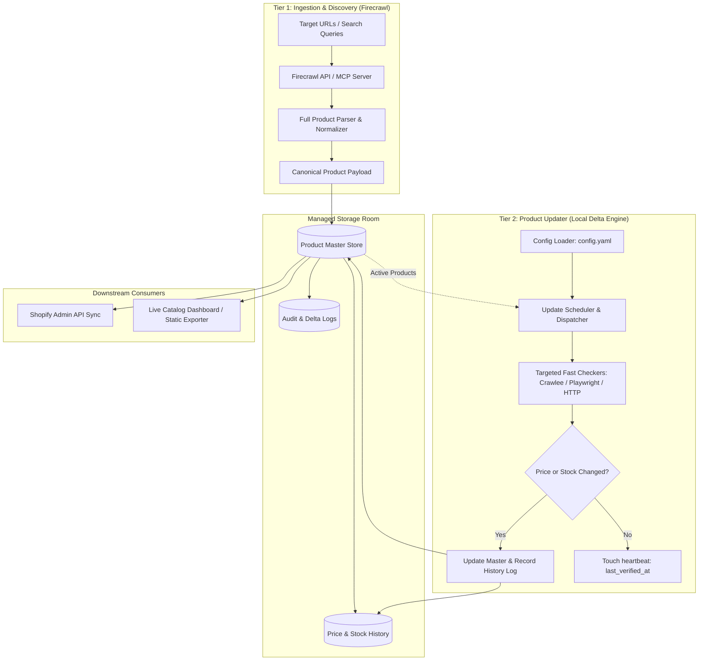

# System Architecture Specification

## 1. Architectural Vision

Traditional scrapers combine discovery, deep attribute extraction, anti-bot circumvention, scheduling, and database persistence into a single script. When a website alters its layout or increases bot-detection measures, the entire pipeline collapses.

The **Product Updater** architecture decouples discovery from periodic updates:



---

## 2. Component Specifications

### 2.1 Tier 1: Ingestion Engine (Firecrawl)
- **Role**: Initial product discovery, rich metadata extraction, and catalog baseline establishment.
- **Tools**: Firecrawl API / Hosted MCP (`https://mcp.firecrawl.dev/v2/mcp`).
- **Data Extracted**:
  - Identity: Title, Brand, Category taxonomy, Model/Style SKU, Canonical URL.
  - Media: High-resolution image URLs, thumbnail mappings, color-specific image sets.
  - Variants: Color options, Size matrix, Variant SKUs, UPCs.
  - Detailed Attributes: Fabric/Material composition, Country of Origin, Care instructions bullet list, Technical specifications.
- **Trigger**: On-demand when new collections or targets are introduced.

### 2.2 Managed Storage Room (The Core Repository)
- **Role**: Structured, authoritative persistent store for all catalog products and their operational states.
- **Key Tables / Entities**:
  1. `products`: Canonical entity containing fixed attributes (title, brand, description, category, images, variants, materials).
  2. `product_variants`: Variant-level options (color, size, SKU, current price, stock state).
  3. `price_history`: Time-series ledger recording timestamp, variant ID, old price, new price, and discount percentage.
  4. `stock_history`: Time-series log of availability shifts (`in_stock`, `out_of_stock`, `low_stock`).
  5. `update_jobs`: Ledger of update runs, durations, success/failure counts, and rate metrics.

### 2.3 Tier 2: Product Updater (Local Delta Engine)
- **Role**: Frequent, high-speed polling of existing products to detect price fluctuations and stock depletion.
- **Key Characteristics**:
  - **Lightweight**: Does not download whole pages, heavy media, or re-parse static descriptions.
  - **Targeted**: Focuses strictly on the price container and stock indicator or JSON hydration blobs.
  - **Config-Driven**: Frequencies and rate limits are read from `config.yaml`.
  - **Tooling**:
    - Fast HTTP Session Pool (for API endpoints or script tag JSON).
    - Crawlee / Camoufox (for JavaScript-heavy or bot-protected sites).
    - Playwright (fallback for full dynamic checkout simulation).

---

## 3. Data Contract: Canonical Product Payload

When Firecrawl ingests a product, it normalizes the raw output into a strict schema before persisting to the Storage Room:

```json
{
  "source_site": "brand_slug",
  "source_sku": "SKU-12345",
  "source_url": "https://brand.com/products/example",
  "title": "Clean Product Title",
  "brand": "Standardized Brand Name",
  "category_path": ["Women", "Bags", "Totes"],
  "description": "Full marketing description...",
  "bullet_points": [
    "100% Full-grain leather",
    "Zip-top closure",
    "Interior slip pockets"
  ],
  "material": "Full-grain leather with fabric lining",
  "care_instructions": ["Wipe clean with soft dry cloth"],
  "country_of_origin": "Italy",
  "specifications": {
    "dimensions": "12.5\" W x 10\" H x 4.5\" D",
    "handle_drop": "9\""
  },
  "images": [
    { "url": "https://...", "color": "Black", "position": 1 }
  ],
  "variants": [
    {
      "sku": "SKU-12345-BLK",
      "color": "Black",
      "size": "One Size",
      "price_current": 14500.0,
      "price_original": 18000.0,
      "currency": "INR",
      "is_available": true
    }
  ]
}
```

---

## 4. Delta Update Workflow

1. **Schedule Trigger**: Cron or timer triggers a delta check according to configured intervals (e.g. every 10 minutes).
2. **Product Batching**: Products due for verification are partitioned into concurrency batches according to per-site rate limits.
3. **Execution**: The updater fetches only the price and availability fields.
4. **Comparison & Audit**:
   - If price has shifted by > 0: Record an entry in `price_history` and update `products.current_price`.
   - If availability has flipped: Record an entry in `stock_history` and update `products.availability`.
   - If unchanged: Update `last_verified_at` timestamp.
